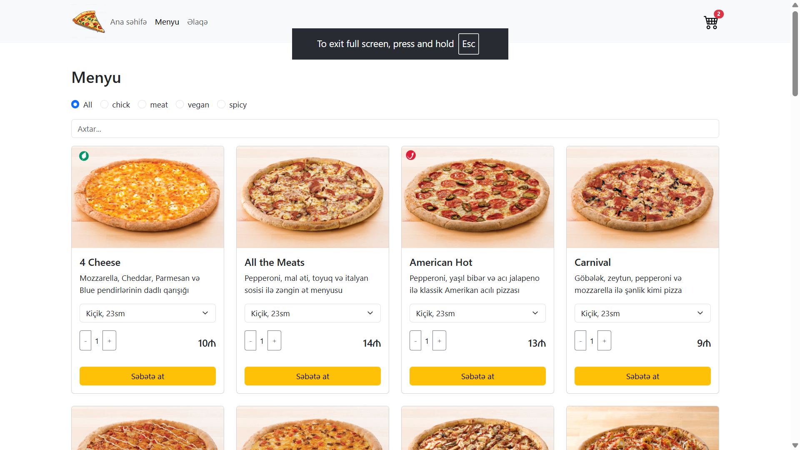
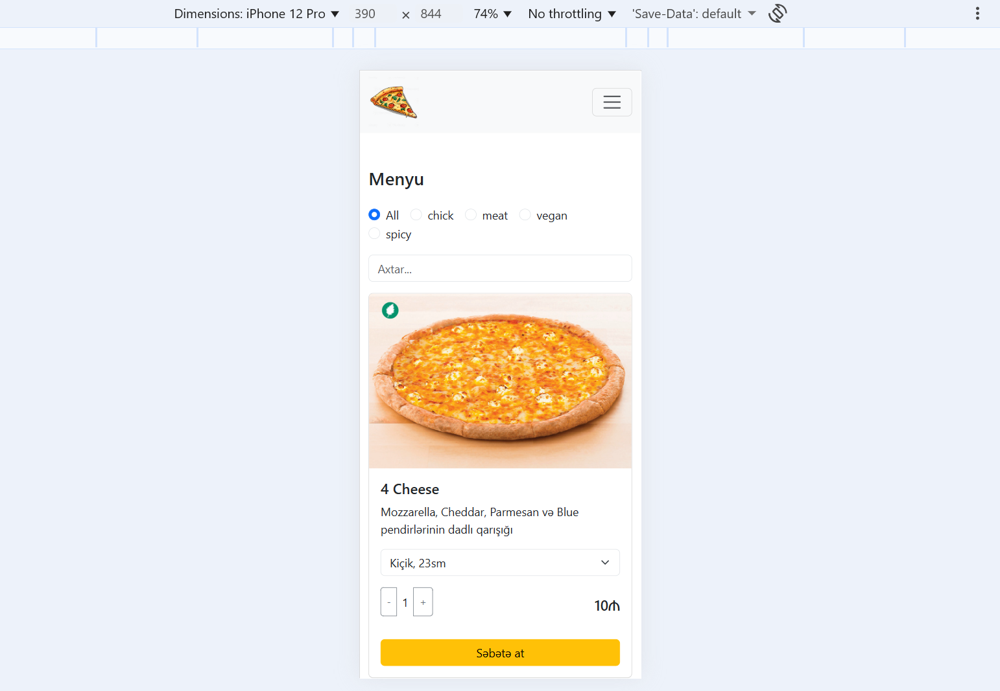

# 🍕 Pizza App - React.js Ordering System

A modern, fast, and responsive pizza ordering application built with **React.js**. This project features a dynamic menu, real-time basket management, and a mobile-optimized checkout experience.


## ✨ Features

* **Dynamic Menu:** Browse various pizza types with different sizes and prices.
* **Smart Basket:** Add, remove, or update item quantities with instant price calculation.
* **Responsive Design:** Fully optimized for both Desktop (Table view) and Mobile (Card/Vertical view).
* **State Management:** Powered by React Context API for seamless data flow.
* **Modern UI:** Built using React-Bootstrap for a clean and professional look.

## 🛠️ Tech Stack

* **Frontend:** React.js (Hooks & Context API)
* **Styling:** CSS3 & React-Bootstrap
* **Icons:** React Icons (FaRegTrashAlt)
* **Deployment:** (e.g., Vercel / Netlify / GitHub Pages)

## 📸 Preview

<p align="center">
  
  &nbsp;&nbsp;
  
</p>

## 🚀 Getting Started

To run this project locally:

1. **Clone the repository:**
   ```bash
   git clone [https://github.com/quliyevmehemmed/pizza-app.git](https://github.com/quliyevmehemmed/pizza-app.git)
